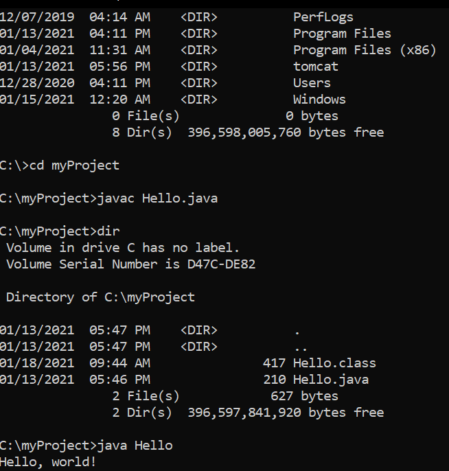
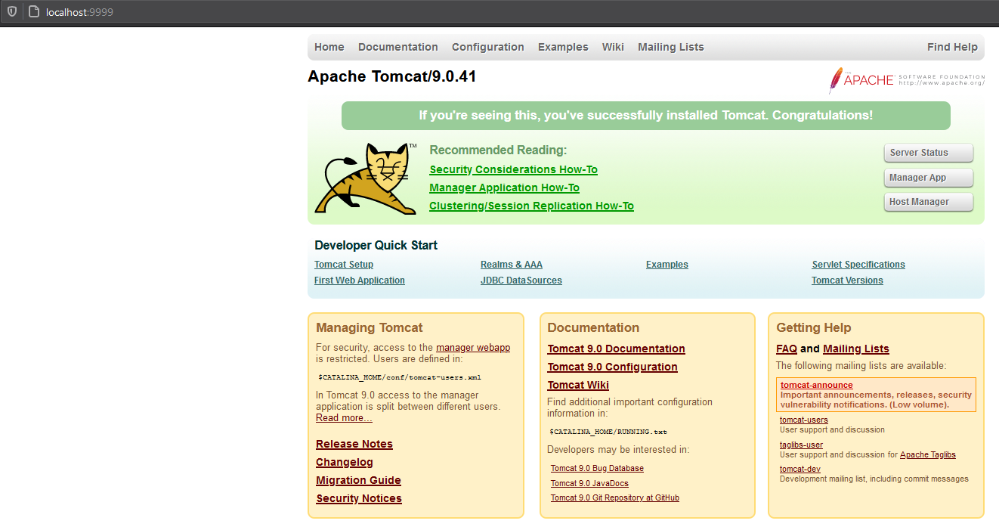
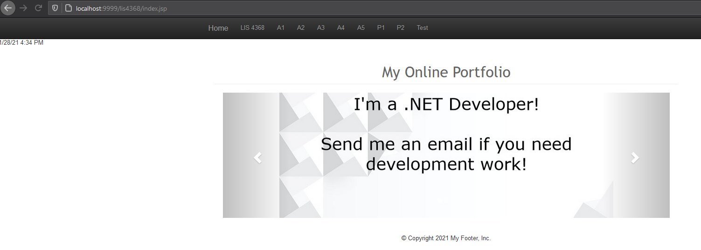

> **NOTE:** This README.md file should be placed at the **root of each of your repos directories.**
>
>Also, this file **must** use Markdown syntax, and provide project documentation as per below--otherwise, points **will** be deducted.
>

# LIS4368 Advance Web Applications Development

## Justin Davis

### Assignment #1 Requirements:

#### README.md file should include the following items:

* Distributed Version Control with Git and Bitbucket   
* Java/JSP/Servlet Development Installation
* Chapter Questions (Chs 1-4)
* Screenshot of running Java Hello
* Screenshot of running http://localhost:9999
* git commands w/ short descriptions
* Bitbucket repo links: a) this assignment and b) the completed tutorial above (bitbucketstationlocations)

[comment]: <> (> This is a blockquote.)
> 
[comment]: <> (> This is the second paragraph in the blockquote.)
>
> #### Git commands w/short descriptions:

1. git-init - Create an empty Git repository or reinitialize an existing one
2. git-status - Show the working tree status
3. git-add - Add file contents to the index
4. git-commit - Record changes to the repository
5. git-push - Update remote refs along with associated objects
6. git-pull - Fetch from and integrate with another repository or a local branch
7. git-clone - Clone a repository into a new directory

#### Assignment Screenshots:

*Screenshot of running java Hello*:

*Screenshot of running http://localhost:9999*:

*Screenshot of assignment #1 on Tomcat*:

#### Tutorial Links:

*Bitbucket Tutorial - Station Locations:*
[A1 Bitbucket Station Locations Tutorial Link](https://bitbucket.org/jd19z/bitbucketstationlocations/ "Bitbucket Station Locations")