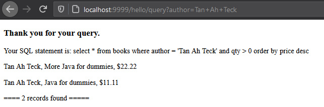
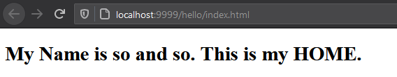
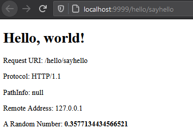
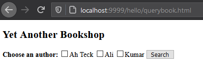
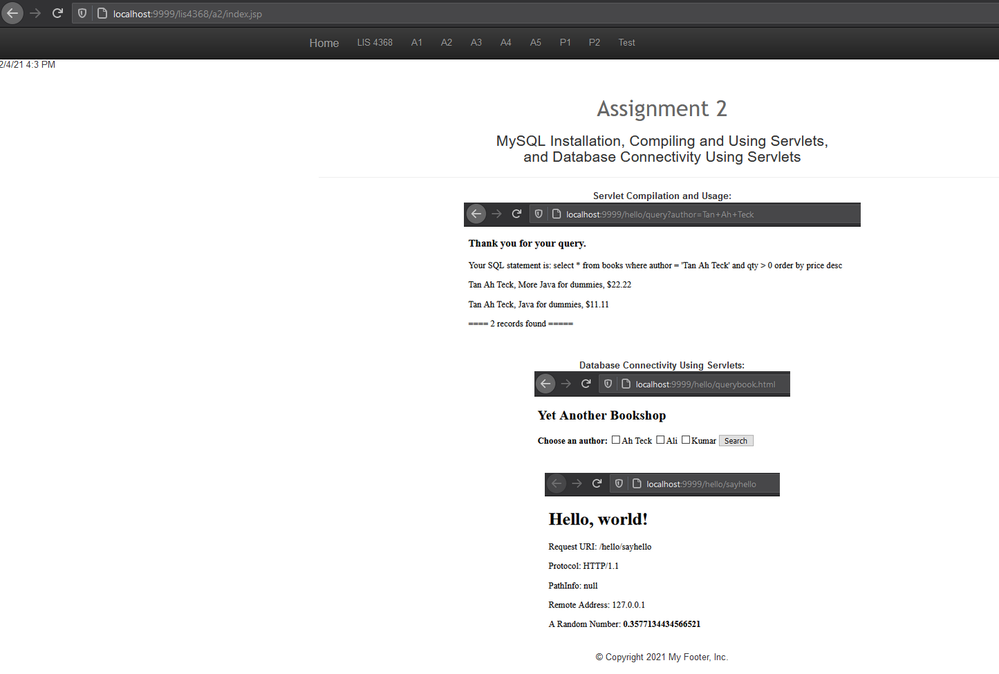

# LIS4368 Advance Web Applications Development

## Justin Davis

### Assignment #2 Requirements:

* The following links should properly display
* http://localhost:9999/hello(Displays directory! It should not! Needs index.html)
* http://localhost:9999/hello/sayhello(invokes HelloServlet)
* http://localhost:9999/hello/querybook.html

#### README.md file should include the following items:

* Assessment links (as above), and
* Only *one* screenshot of the query results from the following link http://localhost:9999/hello/querybook.html

#### Assignment Screenshots:

*Screenshot of query results*:

*Screenshot of http://localhost:9999/hello*:             |  *Screenshot of http://localhost:9999/hello/sayhello*:             | Screenshot of * http://localhost:9999/hello/querybook.html*:
:-------------------------:|:-------------------------:|:------------------------------------------------:
  |    | 

*Screenshot of A2 Portfolio*:

#### Tutorial Links:

*Bitbucket Tutorial - Station Locations:*
[A1 Bitbucket Station Locations Tutorial Link](https://bitbucket.org/jd19z/bitbucketstationlocations/ "Bitbucket Station Locations")