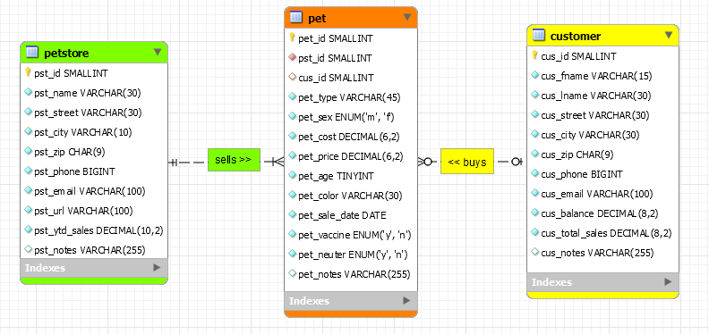

> **NOTE:** This README.md file should be placed at the **root of each of your repos directories.**
>
>Also, this file **must** use Markdown syntax, and provide project documentation as per below--otherwise, points **will** be deducted.
>

# LIS4368 Advance Web Applications Development

## Justin Davis

### Assignment #3 Requirements:

* Create a petstore table, pet table, and customer table
* Each table requires at least 10 records, *and* be able to forward-engineer locally
* Create an ERD for the database

#### README.md file should include the following items:

* Screenshot of ERD;
* Screenshot of a3/index.jsp
* Links to the following items:
    * a3.mwb
    * a3.sql

#### Assignment Screenshots:

*Screenshot of ERD*

*A3 docs: a3.mwb and a3.sql*:

[A3 MWB File](docs/a3/lis4368_a3.mwb "A3 ERD in .mwb format")
[A3 SQL File](docs/lis4368_a3.sql "A3 SQL Script")

#### Tutorial Links:

*Bitbucket Tutorial - Station Locations:*
[A1 Bitbucket Station Locations Tutorial Link](https://bitbucket.org/jd19z/bitbucketstationlocations/ "Bitbucket Station Locations")