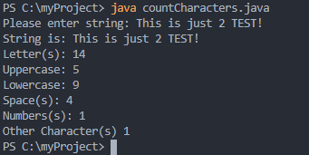

# LIS4368 Advance Web Applications Development

## Justin Davis

### Assignment #4 Requirements:

* Compile servlet files
* Complete SS10 - SS12

#### README.md file should include the following items:

* Screenshots of passed and failed validation
* Screenshots of SS10 - SS12

#### Assignment Screenshots:

*Screenshot of ERD*

Screenshot of Passed Validation             |  Screenshot of Failed Validation          
:-------------------------:|:-------------------------:|
  |  

#### Skill Sets Code:

[SS10](docs/countCharacters.java)

[SS11](docs/FileWriteReadCount.java)

[SS12](docs/Ascii.java)

*Screenshot of running JDK SS10-SS12*:

Gif of SS10             |  Screenshot of SS11             | Screenshot of SS12          
:-------------------------:|:-------------------------:|:------------------------------------------------:
  |    | 

#### Tutorial Links:

*Bitbucket Tutorial - Station Locations:*
[A1 Bitbucket Station Locations Tutorial Link](https://bitbucket.org/jd19z/bitbucketstationlocations/ "Bitbucket Station Locations")