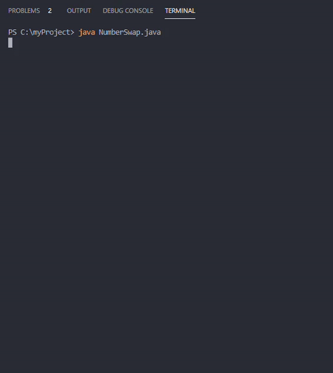
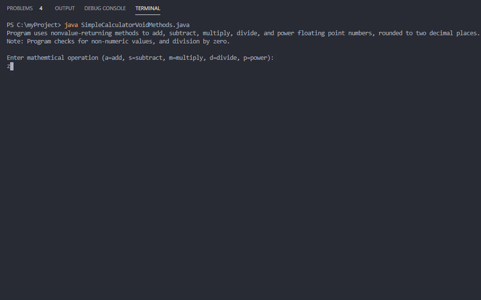

# LIS4368 Advance Web Applications Development

## Justin Davis

### Assignment #5 Requirements:

* Include server-side validation from A4
* Compile serverlet files

#### README.md file should include the following items:

* Screenshots of pre-, post-*valid user form entry*
* Screenshots of MySQL customer table entry

#### Assignment Screenshots:

*Screenshot of ERD*

Screenshot of Pre-Validation             |  Screenshot of Post-Validation       
:-------------------------:|:-------------------------:|
  |  

*Screenshot of MYSQL entry*

MYSQL entry             |
:-------------------------:|
 |

#### Skill Sets Code:

[SS13](docs/NumberSwap.java)

[SS14](docs/LargestThreeNumbers.java)

[SS15](docs/Ascii.java)

*Screenshot of running JDK SS13-SS15*:

Gif of SS13             |  Screenshot of SS14             | Screenshot of SS15          
:-------------------------:|:-------------------------:|:------------------------------------------------:
  |    | 

#### Tutorial Links:

*Bitbucket Tutorial - Station Locations:*
[A1 Bitbucket Station Locations Tutorial Link](https://bitbucket.org/jd19z/bitbucketstationlocations/ "Bitbucket Station Locations")