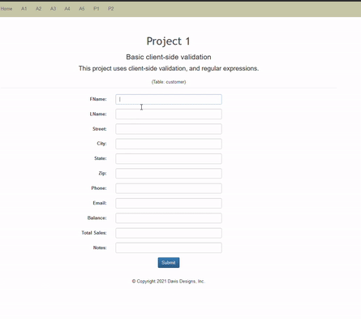

> **NOTE:** This README.md file should be placed at the **root of each of your repos directories.**
>
>Also, this file **must** use Markdown syntax, and provide project documentation as per below--otherwise, points **will** be deducted.
>

# LIS4368 Advance Web Applications Development

## Justin Davis

### Project 1 Requirements:

* Suitably modify meta tags in index.jsp.
* Change title, navigation links, and header tags appropriately.
* Add form controls to match attributes of *customer* entity.
* Use *regex* to only allow appropriate characters for each control.

#### README.md file should include the following items:

* Screenshot of Main Page.
* Screenshot of failed data validation.
* Screenshot of successful validation.

#### Assignment Screenshots:

*Screenshot of Main Page*:

*Gif of Form Controls*:

*Screenshot of Failed Data Validation*

*Screenshot of Passed Data Validation*

#### Tutorial Links:

*Bitbucket Tutorial - Station Locations:*
[A1 Bitbucket Station Locations Tutorial Link](https://bitbucket.org/jd19z/bitbucketstationlocations/ "Bitbucket Station Locations")