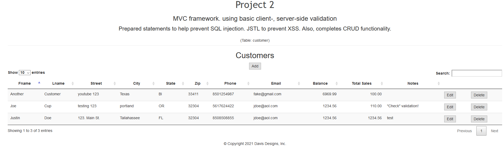
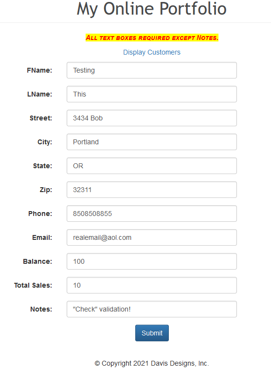
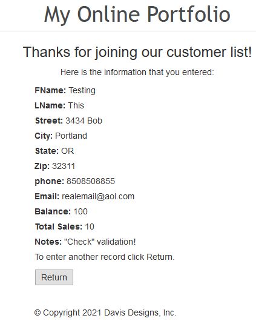
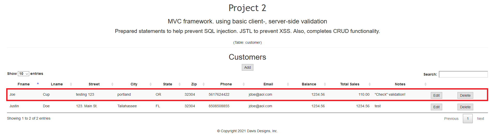
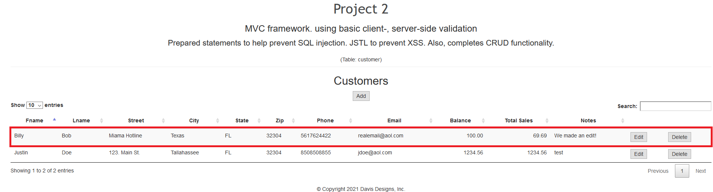
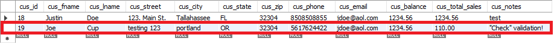
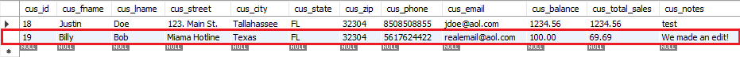
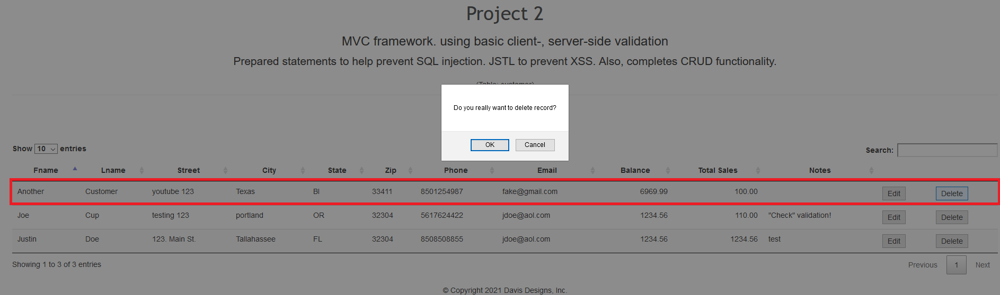
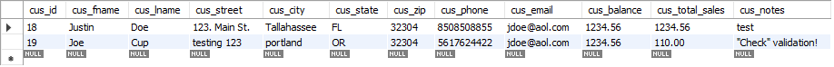

# LIS4368 Advance Web Applications Development

## Justin Davis

### Project 2 Requirements:

* Include server-side validation from A4
* Complete the JSP/Servlets web application using the MVC framework and providing *create*, *read*, *update*, and *delete* (CRUD) functionalilty

#### README.md file should include the following items:

* Screenshot of Main Page.
* Screenshot of adding a customer.
* Screenshot of editing a customer.
* Screenshot of deleting a customer.

#### Assignment Screenshots:

*Screenshot of Customers:*    |  *Screenshot of join form:*             | *Screenshot of thanks page*:
:-------------------------:|:-------------------------:|:------------------------------------------------:
  |    | 

*Screenshot of edit:*    |  *Screenshot of edited page:* 
:-------------------------:|:-------------------------:|
  |  

*Screenshot of Edit DB:*    |  *Screenshot of Edited DB:* 
:-------------------------:|:-------------------------:|
  |  

*Screenshot of delte DB:*    |  *Screenshot of deleted DB:* 
:-------------------------:|:-------------------------:|
  |  

#### Tutorial Links:

*Bitbucket Tutorial - Station Locations:*
[A1 Bitbucket Station Locations Tutorial Link](https://bitbucket.org/jd19z/bitbucketstationlocations/ "Bitbucket Station Locations")